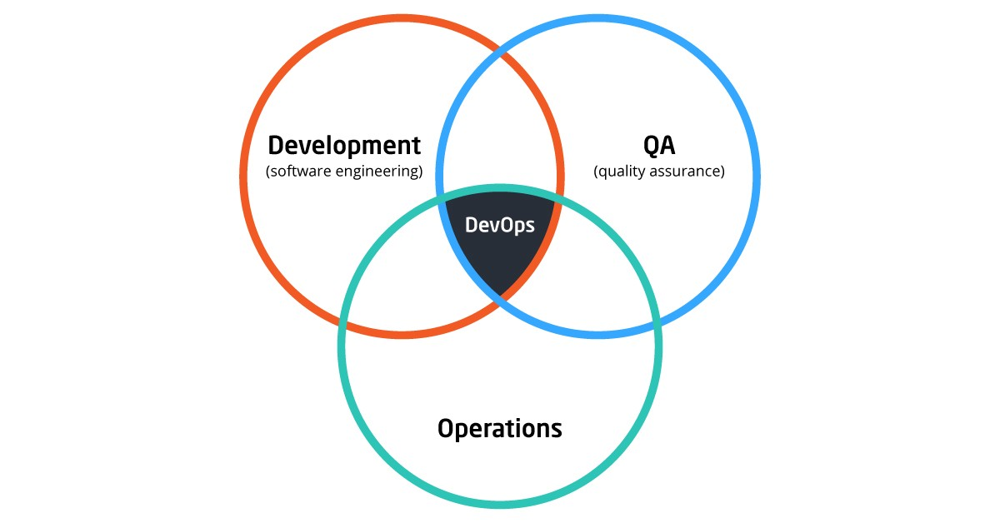

## What is DevOps?

 
- DevOps is not an individual, nor is it a specific tool or technology. DevOps typically incorporates common methodologies such as continuous integration, continuous delivery and automation.
- DevOps is a cultural shift and the adoption of a specific mindset -- one that emphasizes communication and collaboration among development and IT operations teams, as well as with other stakeholders.

## What problems does DevOps try to solve?

- DevOps tries to address many of the issues inherent in traditional application development and delivery methodologies, with the goal of improving operations throughout the application development lifecycle. 
- The following list includes several of the issues that DevOps tries to address.

   - The application delivery process is slow, with fixes and updates taking too long.
   - Siloes between development, operations and other stakeholders make it difficult to work toward common application delivery goals.
   - Applications do not run correctly in all environments. They might work fine during development and testing but not when they're deployed in a production environment.

Problems with an application are often discovered late in the development lifecycle, making them more difficult, time-consuming and costly to resolve.
The process of identifying and resolving issues can be complex and time-consuming, often leading to unexpected delays and cost overruns.
Traditional application development and delivery methodologies are full of repetitive and manual tasks that take too long and use up valuable time.

##  What benefits does DevOps offer?

DevOps offers numerous benefits, and candidates should understand what these are and why they make DevOps so valuable. The following list includes several of these benefits:

- Streamlines software delivery and deployment processes
- Reduces the number of silos between IT groups
- Increases communications between team members and other stakeholders
- Incorporates faster feedback, resulting in quicker software improvements
- Automates repetitive, manual tasks, leading to increased efficiency
- Results in less downtime and faster time to market
- Provides an infrastructure for continuous software development and delivery

## What are some of the challenges that come with implementing DevOps?

The following list describes some of these challenges.

- DevOps can result in IT departmental changes or shifts in personnel and often requires special training or new skills.
- A DevOps environment can raise security and compliance challenges that might require additional resources to address.
- DevOps can be difficult to scale across projects and teams.
- DevOps tools and platforms can be costly and complex, often requiring additional training and support.
- Organizations often implement DevOps while still supporting traditional methodologies, resulting in increased complexity and expense.
- Creating the right DevOps culture can often be a challenge, especially if individuals are resistant to change or if leadership isn't fully onboard.
- Moving from traditional tools and methodologies to DevOps takes careful planning and preparation and can be a complex, time-consuming process, even under the best circumstances.

## What is shift-left in DevOps?

The concept of shifting left in DevOps is based on the idea that the application development and delivery process can be graphically represented as a workflow that moves from left to right. In traditional approaches to application development, tasks such as testing software are often done later in the development process, nearer to the right end of the graph. But DevOps moves such tasks toward the left end, that is, sooner in the development process. This shift to the left makes it possible to identify issues while they're still more manageable, resulting in faster development cycles and more streamlined operations.

## Who are DevOps Engineers? 

DevOps engineers are a group of influential individuals who encapsulates depth of knowledge and years of hands-on experience around a wide variety of open source technologies and tools. They come with core attributes which involve an ability to code and script, data management skills as well as a strong focus on business outcomes. They are rightly called “Special Forces” who hold core attributes around collaboration, open communication and reaching across functional borders.

DevOps engineer always shows interest and comfort working with frequent, incremental code testing and deployment. With a strong grasp of automation tools, these individuals are expected to move the business quicker and forward, at the same time giving a stronger technology advantage. In nutshell, a DevOps engineer must have a solid interest in scripting and coding,  skill in taking care of deployment automation, framework computerization and capacity to deal with the version control system.

## What are the qualities of a DevOps Engineer 

Collated below are the characteristics/attributes of the DevOps Engineer.

- Experience in a wide range of open source tools and techniques
- A Broad knowledge on Sysadmin and Ops roles
- Expertise in software coding, testing, and deployment
- Experiences on DevOps Automation tools like Ansible, Puppet, and Chef
- Experience in Continuous Integration, Delivery & Deployment
- Industry-wide experience in implementation of  DevOps solutions for team collaborations
- A firm knowledge of the various computer programming languages
- Good awareness in Agile Methodology of Project Management
- A Forward-thinker with an ability to connect the technical and business goals     
- Demand for people with DevOps skills is growing rapidly because businesses get great results from DevOps. Organizations using DevOps practices are overwhelmingly high-functioning: They deploy code up to 30 times more frequently than their competitors, and 50 percent fewer of their deployments fail.

## What exactly DevOps Engineer do?

DevOps is not a way to get developers doing operational tasks so that you can get rid of the operations team and vice versa.  Rather it is a way of working that encourages the Development and Operations teams to work together in a highly collaborative way towards the same goal. In nutshell, DevOps integrates developers and operations team to improve collaboration and productivity.

The main goal of DevOps is not only to increase the product’s quality to a greater extent but also to increase the collaboration of Dev and Ops team as well so that the workflow within the organization becomes smoother & efficient at the same time.

DevOps Engineer has an end-to-end responsibility of the Application (Software) right from gathering the requirement to development, to testing, to infrastructure deployment, to application deployment and finally monitoring & gathering feedback from the end users, then again implementing the changes. These engineers spend more time researching new technologies that will improve efficiency and effectiveness.They Implement highly scalable applications and integrate infrastructure builds with application deployment processes.

 Let us spend some time in understanding the list of most important DevOps Engineers’ roles and responsibilities.

1) The first and foremost critical role of a DevOps Engineer is to be an effective communicator i.e Soft Skills. A DevOps Engineer is required to be a bridge between the silos and bring different teams together to work towards a common goal. Hence, you can think of DevOps Engineers as “IT Project Managers”. They typically work on a DevOps team with other professionals in a similar role, each managing their own piece of the infrastructure puzzle.

2) The second critical role of DevOps Engineer is to be Expert Collaborators. This is because their role requires them to build upon the work of their counterparts on the development and IT teams to scale cloud programs, create workflow processes, assign tenants and more.

3) Thirdly, they can be rightly called “Mentors” as they spend most of the time in mentoring and educating software developers and architecture teams within an organization on how to create software that is easily scalable. They also collaborate with IT and security teams to ensure quality releases.

Next, they need to be a “customer-service oriented” individuals. The DevOps Engineer is a customer-service oriented, team player who can emerge from a number of different work and educational backgrounds, but through their experience has developed the right skillset to move into DevOps.

The DevOps Engineer is an important IT team member because they work with an internal customer. This includes QC personnel, software and application developers, project managers and project stakeholders usually from within the same organization. Even though they rarely work with external customers or end-users, but they keep close eye on  a “customer first” mindset to satisfy the needs of their internal clients.

Not to miss out, DevOps engineer holds broad knowledge and experience with Infrastructure automation tools. A key element of DevOps is automation.  A lot of the manual tasks performed by the more traditional system administrator and engineering roles can be automated by using scripting languages like Python, Ruby, Bash, Shell, Node.js. This ensures a consistent performance of manual tasks by removing the human component and allowing teams to spend the saved time on more of the broader goals of the team and company.

Hence, a DevOps engineer must possess the ability to implement automation technologies and tools at any level, from requirements to development to testing and operations.

## Can you tell me other responsibilities of DevOps Engineer?

- Manage and maintain infrastructure system
- Maintaining and developing highly automated services landscape and open source services
- Take over the ownership for integral components of technology and make sure it grows aligned with company success
- Scale systems and ensure the availability of services with developers on changes to the infrastructure required by new features and products.

## How to become a DevOps engineer?

DevOps is less about doing things a particular way, and more about moving the business forward and giving it a stronger technological advantage. There is not a single cookbook or path to become a DevOps professional. It's a continuous learning and consulting process. Every DevOps tasks have been originated from various development, testing, ops team consulting through consultants and running pilots, therefore it’s hard to give a generic playbook for how to get it implemented. Everyone should start with learning about the values, principles, methods, and practices of DevOps and trying to share it via any channel and keep learning.

Here’s my 10 golden tips to become a DevOps Engineer:

- Develop Your Personal Brand with Community Involvement
- Get familiar with IaC(Infrastructure-as-Code) - CM
- Understand DevOps Principles & Frameworks
- Demonstrate Curiosity & Empathy
- Get certified on Container Technologies - Docker | Kubernetes| Cloud
- Get Expert in Public | Private | Hybrid Cloud offering
- Become an Operations Expert before you even THINK DevOps
- Get Hands-on with various Linux Distros & Tools
- Arm Yourself with CI-CD, Automation & Monitoring Tools(Github, Jenkins, Puppet, Ansible etc)
- Start with Process Re-Engineering and Cross-collaboration within your teams.

## Skills that DevOps engineer need to have 

If you’re aiming to land a job as a DevOps engineer in 2018, it’s not only about having a deep specialized skill but understanding how a variety of technologies and skills come together. One of the things that makes DevOps both challenging to break into is that you need to be able to write code, and also to work across and integrate different systems and applications. Based on my experience, I have finalized on the list of top 5 skill sets  which you might require to be a successful DevOps engineer:

### SysAdmin with Virtualization Experience

Deployment is a major requirement in devops role and ops engineer are good at that, All is needed is a deployments automation engine(chef, puppet, ansible) knowledge and its use-cases implementations. Nowadays, most of public clouds are running multiple flavors of virtualization so a must have 3 – 5 years of virtualization experience with VMware, KVM, Xen, Hyper-V is required along.

### Solution Architect Role

Along with deployments or virtualization experience, understanding and implementation of all the hardware technologies in breadth is a must like storage and networking. Nowadays there is a very high-demand for people who can design a solution that scales and performs with high availability and uptime with minimal amount of resources to feed on (Max utilization).

### A Passionate Programmer/API Expertise

Bash, Powershell, Perl, Ruby, JavaScript, Go, Python etc are few of popular scripting languages one need to have expertise on to become an effective DevOps Engineer. A DevOps engineer must be able to write code to automated repeatable processes. One need to be familiar with RESTFUL APIs.

###  Integration Skillset around CI-CD tool

A DevOps engineer should be able to use all his expertise to integrate all the open source tools and techniques to create an environment that is fully automated and integrated. The goal should be for zero manual intervention from source code management to deployment state, i.e. Continuous Integration, Continuous Delivery and Continuous Deployment.

### Bigger Picture & Customer Focus

While the strong focus on coding chops makes software engineering a natural path to a career in DevOps, the challenge for candidates who are coming from this world is that they need to be able to prove that they can look outside their immediate team and project. DevOps engineers are responsible for facilitating collaboration and communication between the Development and IT teams within an organization, so to succeed in an interview, you’ll need to be able to demonstrate your understanding of how disparate parts of the technical organization fit and work together.

In nutshell, all you need are the list of tools and technologies listed below -

- Source Control (like Git, Bitbucket, Svn, VSTS etc)
- Continuous Integration (like Jenkins, Bamboo, VSTS )
- Infrastructure Automation (like Puppet, Chef, Ansible)
- Deployment Automation & Orchestration (like Jenkins, VSTS, Octopus Deploy)
- Container Concepts (LXD, Docker)
- Orchestration (Kubernetes, Mesos, Swarm)
- Cloud (like AWS, Azure, Google Cloud, Openstack)
