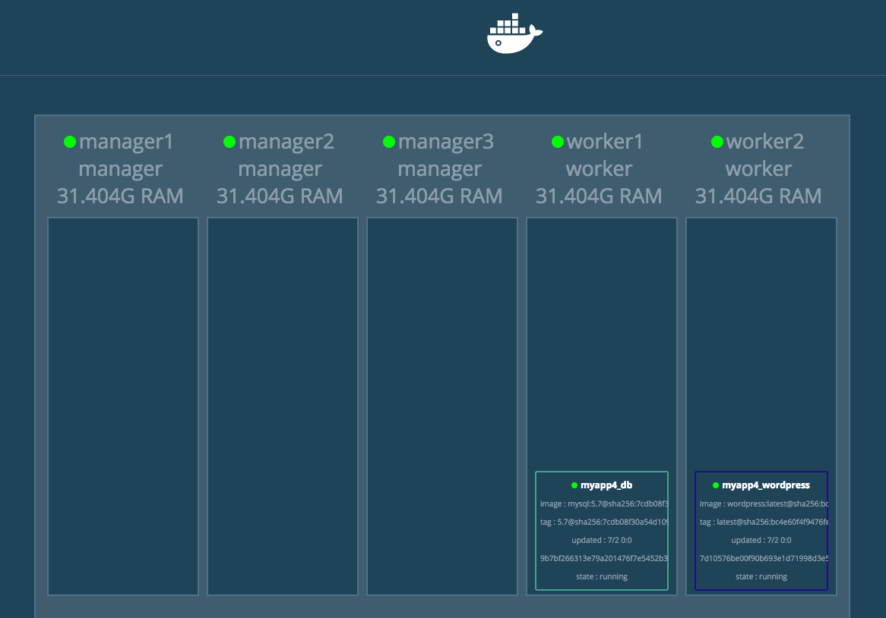
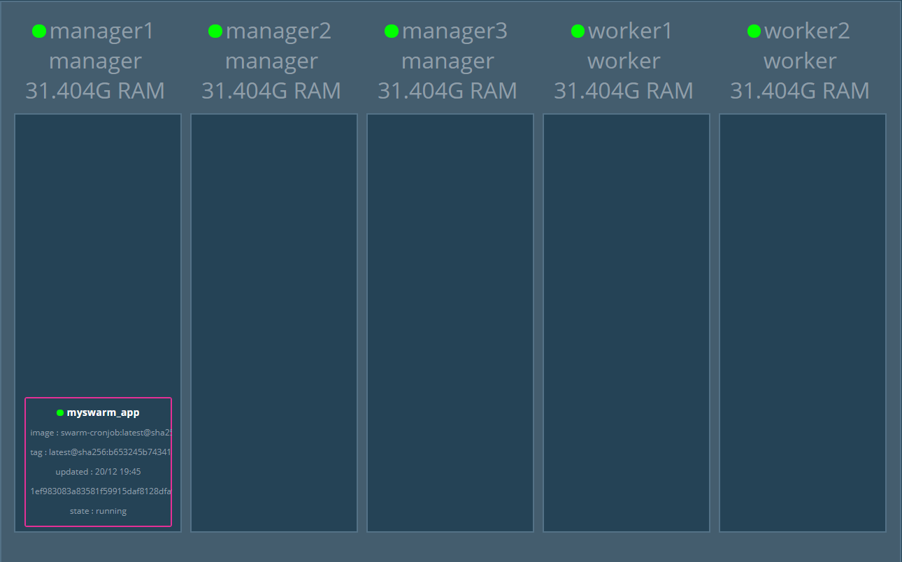
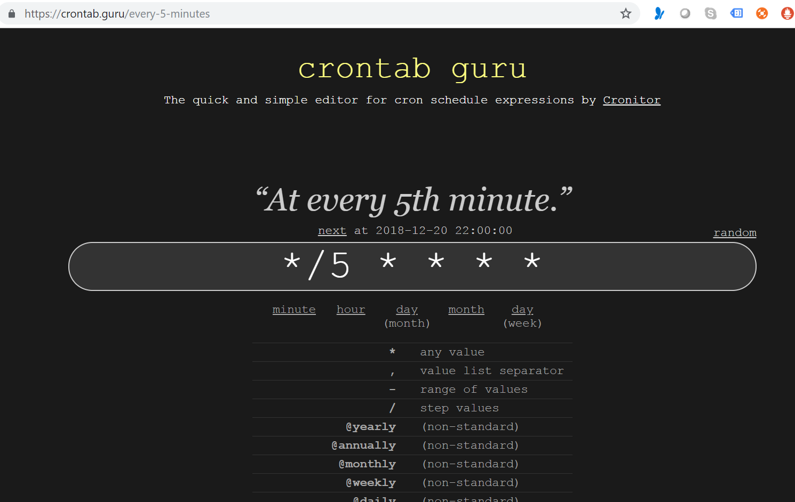
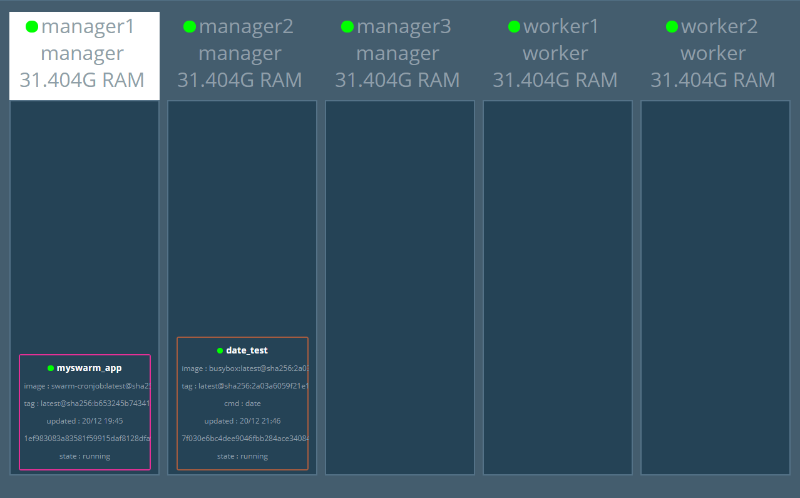
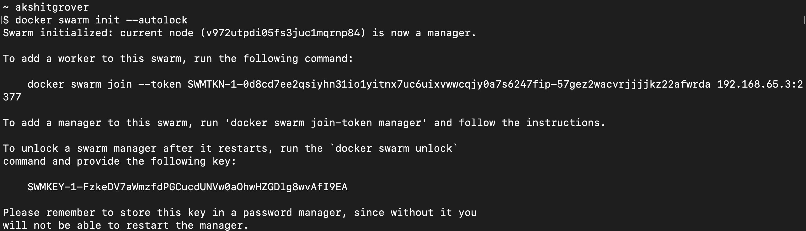
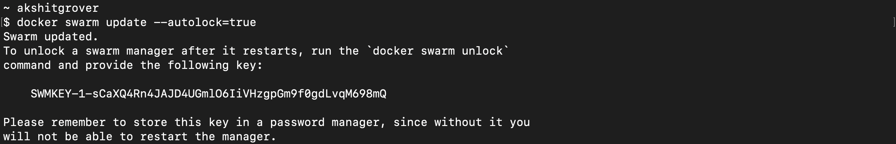

# What is Docker Swarm?


Docker Swarm is a container orchestration tool built and managed by Docker, Inc. It is the native clustering tool for Docker. Swarm uses the standard Docker API, i.e., containers can be launched using normal docker run commands and Swarm will take care of selecting an appropriate host to run the container on. This also means
that other tools that use the Docker API—such as Compose and bespoke scripts—can use Swarm without any changes and take advantage of running on a cluster rather than a single host.


# But why do we need Container orchestration System?

Imagine that you had to run hundreds of containers. You can easily see that if they are running in a distributed mode, there are multiple features that you will need from a management angle to make sure that the cluster is up and running, is healthy and
more.

Some of these necessary features include:

● Health Checks on the Containers <br>
● Launching a fixed set of Containers for a particular Docker image<br>
● Scaling the number of Containers up and down depending on the load<br>
● Performing rolling update of software across containers<br>
● and more…<br>

Docker Swarm has capabilities to help us implement all those great features - all through simple CLIs.


# Does Docker Swarm require 3rd Party tool to be installed?

Docker Swarm Mode comes integrated with Docker Platform. Starting 1.12, Docker Swarm Mode is rightly integrated which means that you don't need to install anything outside to run Docker Swarm. Just initialize it and you can get started.

# Does Docker Swarm work with Docker Machine & Docker Compose?

Yes, it works very well with the Docker command line tools like docker and docker-machine, and provides the basic ability to deploy a Docker container to a collection of machines running the Docker Engine. Docker Swarm does differ in scope, however, from what we saw when reviewing Amazon ECS.

# How does Swarm Cluster look like?


The basic architecture of Swarm is fairly straightforward: each host runs a Swarm agent and one host runs a Swarm manager (on small test clusters this host may also run an agent). The manager is responsible for the orchestration and scheduling of containers on the hosts. Swarm can be run in a high-availability mode where one of etcd, Consul or ZooKeeper is used to handle fail-over to a back-up manager. There are several different methods for how hosts are found and added to a cluster, which is known as discovery in Swarm. By default, token based discovery is used, where the addresses of hosts are kept in a list stored on the Docker Hub.


A swarm is a group of machines that are running Docker and joined into a cluster. After that has happened, we continue to run the Docker commands we’re used to, but now they are executed on a cluster by a swarm manager. The machines in a swarm can be physical or virtual. After joining a swarm, they are referred to as nodes.

Swarm managers are the only machines in a swarm that can execute your commands, or authorize other machines to join the swarm as workers. Workers are just there to provide capacity and do not have the authority to tell any other machine what it can and cannot do.

Up until now, you have been using Docker in a single-host mode on your local machine. But Docker also can be switched into swarm mode, and that’s what enables the use of swarms. Enabling swarm mode instantly makes the current machine a swarm manager. From then on, Docker runs the commands you execute on the swarm you’re managing, rather than just on the current machine.

Swarm managers can use several strategies to run containers, such as “emptiest node” -- which fills the least utilized machines with containers. Or “global”, which ensures that each machine gets exactly one instance of the specified container. 

A swarm is made up of multiple nodes, which can be either physical or virtual machines. The basic concept is simple enough: run docker swarm init to enable swarm mode and make our current machine a swarm manager, then run docker swarm join on other machines to have them join the swarm as workers. 


[Next >> Difference between Docker Swarm, Docker Swarm Mode and Swarmkit](https://github.com/collabnix/dockerlabs/blob/master/intermediate/swarm/difference-between-docker-swarm-vs-swarm-mode-vs-swarmkit.md)


## Getting Started with Docker Swarm

To get started with Docker Swarm, you can use "Play with Docker", aka PWD. 
It's free of cost and open for all.
You get maximum of 5 instances of Linux system to play around with Docker.

- Open [Play with Docker labs](https://labs.play-with-docker.com) on your browser

- Click on Icon near to Instance to choose 3 Managers & 2 Worker Nodes


- Wait for few seconds to bring up 5-Node Swarm Cluster

We recommend you start with one of our Beginners Guides, and then move to intermediate and expert level tutorials that cover most of the features of Docker. For a comprehensive approach to understanding Docker, I have categorized it as shown below:

# A Bonus... Docker Swarm Visualizer

Swarm Visualizer is a fancy tool which visualized the Swarm Cluster setup. It displays containers running on each node in the form of visuals. If you are conducting Docker workshop, it's a perfect way to show your audience how the containers are placed under each node. Go..try it out..

## Clone the Repository

```docker
git clone https://github.com/dockersamples/docker-swarm-visualizer
```

```docker
cd docker-swarm-visualizer
docker-compose up -d
```



To run in a docker swarm:

```docker
$ docker service create \
  --name=viz \
  --publish=8080:8080/tcp \
  --constraint=node.role==manager \
  --mount=type=bind,src=/var/run/docker.sock,dst=/var/run/docker.sock \
  dockersamples/visualizer
```

[Proceed >> What is Docker Swarm](https://github.com/collabnix/dockerlabs/blob/master/intermediate/swarm/what-is-docker-swarm.md)


# Understanding Difference between Docker Swarm(Classic), Swarm Mode & SwarmKit


**Docker Swarm**  is an older (2014) Docker native orchestration tool. It is _standalone_ from the Docker engine and serves to connect Docker engines together to form a cluster. It&#39;s then possible to connect to the Swarm and run containers on the cluster. Swarm has a few features:

- Allows us to specify a discovery service
- Some control over where containers are placed (using filters / constraints / distribution strategies, etc...)
- Exposes the same API as the Docker engine itself, allowing 3rd-party tools to interact seamlessly

**Swarmkit**  is a new (2016) tool developed by the Docker team which provides functionality for running a cluster and distributing tasks to the machines in the cluster. Here are the main features:

- Distributed: SwarmKit uses the Raft Consensus Algorithm in order to coordinate and does not rely on a single point of failure to perform decisions.
- Secure: Node communication and membership within a Swarm are secure out of the box. SwarmKit uses mutual TLS for node authentication, role authorization and transport encryption, automating both certificate issuance and rotation.
- Simple: SwarmKit is operationally simple and minimizes infrastructure dependencies. It does not need an external database to operate.

**Docker Swarm Mode (Version 1.12 >)** _uses_ Swarmkit libraries &amp; functionality in order to make container orchestration over multiple hosts (a cluster) very simple &amp; secure to operate. There is a new set of features (the main one being docker swarm) which are now built into Docker itself to allow us to initiate a new Swarm and deploy _tasks_ to that cluster.

**Docker Swarm** is not being deprecated, and is still a viable method for Docker multi-host orchestration, but  **Docker Swarm Mode**  (which uses the  **Swarmkit**  libraries under the hood) is the recommended way to begin a new Docker project where orchestration over multiple hosts is required.

One of the big features in Docker 1.12 release is Swarm mode. Docker had Swarm available for Container orchestration from 1.6 release. Docker released Swarmkit as an opensource project for orchestrating distributed systems few weeks before Docker 1.12(RC) release.

&quot;Swarm&quot; refers to traditional Swarm functionality, &quot;Swarm Mode&quot; refers to new Swarm mode added in 1.12, &quot;Swarmkit&quot; refers to the plumbing open source orchestration project.

### Swarm, Swarm Mode and Swarmkit

Following table compares Swarm and Swarm Mode :

| **Swarm** | **Swarm Mode** |
| --- | --- |
| Separate from Docker Engine and can run as Container | Integrated inside Docker engine |
| Needs external KV store like Consul | No need of separate external KV store |
| Service model not available | Service model is available. This provides features like scaling, rolling update, service discovery, load balancing and routing mesh |
| Communication not secure | Both control and data plane is secure |
| Integrated with machine and compose | Not yet integrated with machine and compose as of release 1.12. Will be integrated in the upcoming releases |

Following table compares Swarmkit and Swarm Mode:

| **Swarmkit** | **Swarm Mode** |
| --- | --- |
| Plumbing opensource project | Swarmkit used within Swarm Mode and tightly integrated with Docker Engine |
| Swarmkit needs to built and run separately | Docker 1.12 comes integrated with Swarm Mode |
| No service discovery, load balancing and routing mesh | Service discovery, load balancing and routing mesh available |
| Use swarmctl CLI | Use regular Docker CLI |

Swarmkit has primitives to handle orchestration features like node management, discovery, security and scheduling.


# How Docker Swarm Mode works?

Let us first understand what is Swarm Mode and what are its key concepts.

In 1.12, Docker introduced Swarm Mode. Swarm Mode enables the ability to deploy containers across multiple Docker hosts, using overlay networks for service discovery with a built-in load balancer for scaling the services.

Swarm Mode is managed as part of the Docker CLI, making it a seamless experience to the Docker ecosystem.

## Key Concepts

Docker Swarm Mode introduces three new concepts which we'll explore in this scenario.

### Node: 

A Node is an instance of the Docker Engine connected to the Swarm. Nodes are either managers or workers. Managers schedules which containers to run where. Workers execute the tasks. By default, Managers are also workers.

### Services: 

A service is a high-level concept relating to a collection of tasks to be executed by workers. An example of a service is an HTTP Server running as a Docker Container on three nodes.

### Load Balancing: 

Docker includes a load balancer to process requests across all containers in the service.

## Step 1 - Initialise Swarm Mode

Turn single host Docker host into a Multi-host Docker Swarm Mode. Becomes Manager By default, Docker works as an isolated single-node. All containers are only deployed onto the engine. Swarm Mode turns it into a multi-host cluster-aware engine.

The first node to initialise the Swarm Mode becomes the manager. As new nodes join the cluster, they can adjust their roles between managers or workers. You should run 3-5 managers in a production environment to ensure high availability.

## Create Swarm Mode Cluster

Swarm Mode is built into the Docker CLI. You can find an overview the possibility commands via docker swarm --help

The most important one is how to initialise Swarm Mode. Initialisation is done via init.

```
docker swarm init
```

After running the command, the Docker Engine knows how to work with a cluster and becomes the manager. The results of an initialisation is a token used to add additional nodes in a secure fashion. Keep this token safe and secure for future use when scaling your cluster.

In the next step, we will add more nodes and deploy containers across these hosts.

## Step 2 - Join Cluster

With Swarm Mode enabled, it is possible to add additional nodes and issues commands across all of them. If nodes happen to disappear, for example, because of a crash, the containers which were running on those hosts will be automatically rescheduled onto other available nodes. The rescheduling ensures you do not lose capacity and provides high-availability.

On each additional node, you wish to add to the cluster, use the Docker CLI to join the existing group. Joining is done by pointing the other host to a current manager of the cluster. In this case, the first host.

Docker now uses an additional port, 2377, for managing the Swarm. The port should be blocked from public access and only accessed by trusted users and nodes. We recommend using VPNs or private networks to secure access.

## Task

The first task is to obtain the token required to add a worker to the cluster. For demonstration purposes, we'll ask the manager what the token is via swarm join-token. In production, this token should be stored securely and only accessible by trusted individuals.

```
token=$(docker -H 172.17.0.57:2345 swarm join-token -q worker) && echo $token
```

On the second host, join the cluster by requesting access via the manager. The token is provided as an additional parameter.

```
docker swarm join 172.17.0.57:2377 --token $token
```

By default, the manager will automatically accept new nodes being added to the cluster. You can view all nodes in the cluster using ```docker node ls```

# Lab01 - Create Overlay Network

Swarm Mode also introduces an improved networking model. 
In previous versions, Docker required the use of an external key-value store, such as Consul, to ensure consistency across the network. 
The need for consensus and KV has now been incorporated internally into Docker and no longer depends on external services.

The improved networking approach follows the same syntax as previously. The overlay network is used to enable containers on 
different hosts to communicate. Under the covers, this is a Virtual Extensible LAN (VXLAN), designed for large scale cloud based 
deployments.

## Task

The following command will create a new overlay network called skynet. All containers registered to this network can communicate with 
each other, regardless of which node they are deployed onto.

```
docker network create -d overlay collabnet
```
# Lab02 - Deploy Service

By default, Docker uses a spread replication model for deciding which containers should run on which hosts. 
The spread approach ensures that containers are deployed across the cluster evenly. This means that if one of the nodes is removed from 
the cluster,  the instances would be already running on the other nodes. There workload on the removed node would be rescheduled across 
the remaining available nodes.

A new concept of Services is used to run containers across the cluster. This is a higher-level concept than containers.
A service allows you to define how applications should be deployed at scale. By updating the service, Docker updates the container 
required in a managed way.

## Task
In this case, we are deploying the Docker Image katacoda/docker-http-server. We are defining a friendly name of a service called 
http and that it should be attached to the newly created skynet network.

For ensuring replication and availability, we are running two instances, of replicas, of the container across our cluster.

Finally, we load balance these two containers together on port 80. Sending an HTTP request to any of the nodes in the cluster will process the request by one of the containers within the cluster.
The node which accepted the request might not be the node where the container responds. Instead, Docker load-balances requests across all available containers.

```
docker service create --name http --network collabnet --replicas 2 -p 80:80 ajeetraina/hellowhale
```

You can view the services running on the cluster using the CLI command docker service ls

As containers are started you will see them using the ps command. You should see one instance of the container on each host.

List containers on the first host - 

```
docker ps
```

List containers on the second host - 

```
docker ps
```

If we issue an HTTP request to the public port, it will be processed by the two containers  

```
 curl your_machine_ip:80
```

# Lab03 - Inspecting State

The Service concept allows you to inspect the health and state of your cluster and the running applications.

## Task

You can view the list of all the tasks associated with a service across the cluster. 
In this case, each task is a container, 

```
docker service ps http
```

You can view the details and configuration of a service via 

```
docker service inspect --pretty http
```

On each node, you can ask what tasks it is currently running. Self refers to the manager node Leader: 

```
docker node ps self
```

Using the ID of a node you can query individual hosts 

```
docker node ps $(docker node ls -q | head -n1)
```

In the next step, we will scale the service to run more instances of the container.

# Lab04 - Scale Service

A Service allows us to scale how many instances of a task is running across the cluster. 
As it understands how to launch containers and which containers are running, it can easily start, or remove, containers as required. 
At the moment the scaling is manual. However, the API could be hooked up to an external system such as a metrics dashboard.

# Task

At present, we have two load-balanced containers running, which are processing our requests curl docker

The command below will scale our http service to be running across five containers.

```
docker service scale http=5
```

```
 docker service scale http=5
http scaled to 5
overall progress: 5 out of 5 tasks
1/5: running   [==================================================>]
2/5: running   [==================================================>]
3/5: running   [==================================================>]
4/5: running   [==================================================>]
5/5: running   [==================================================>]
verify: Waiting 4 seconds to verify that tasks are stable...
verify: Service converged
[manager1] (local) root@192.168.0.4 ~
$
[manager1] (local) root@192.168.0.4 ~
```

On each host, you will see additional nodes being started docker ps

The load balancer will automatically be updated. Requests will now be processed across the new containers. 
Try issuing more commands via 

```
curl your_machine_ip:80
```

Try scaling the service down to see the result.

```
docker service scale http=2
```

[Next >> Lab05 - Deploy Applications Components as Docker Services](https://github.com/collabnix/dockerlabs/blob/master/intermediate/swarm/lab05-deploy-application-components-as-docker-services.md)

# Lab #05 - Deploy the application components as Docker services

Our sleep application is becoming very popular on the internet (due to hitting Reddit and HN). 
People just love it. So, you are going to have to scale your application to meet peak demand. 
You will have to do this across multiple hosts for high availability too. 
We will use the concept of Services to scale our application easily and manage many containers as a single entity.

Services were a new concept in Docker 1.12. They work with swarms and are intended for long-running containers.

Let’s deploy sleep as a Service across our Docker Swarm.


```
$ docker service create --name sleep-app ubuntu sleep infinity
k70j90k9cp5n2bxsq72tjdmxs
overall progress: 1 out of 1 tasks
1/1: running
verify: Service converged
```

Verify that the service create has been received by the Swarm manager.

```
$ docker service ls
ID                  NAME                MODE                REPLICAS            IMAGE
     PORTS
k70j90k9cp5n        sleep-app           replicated          1/1                 ubuntu:latest

```

The state of the service may change a couple times until it is running. The image is being downloaded from Docker Store to the other engines in the Swarm. Once the image is downloaded the container goes into a running state on one of the three nodes.

At this point it may not seem that we have done anything very differently than just running a docker run. We have again deployed a single container on a single host. The difference here is that the container has been scheduled on a swarm cluster.

Well done. You have deployed the sleep-app to your new Swarm using Docker services.


# Scaling the Application

Demand is crazy! Everybody loves your sleep app! It’s time to scale out.

One of the great things about services is that you can scale them up and down to meet demand. In this step you’ll scale the service up and then back down.

You will perform the following procedure from node1.

Scale the number of containers in the sleep-app service to 7 with the docker service update --replicas 7 sleep-app command. Replicas is the term we use to describe identical containers providing the same service.

```
$ docker service update --replicas 7 sleep-app
sleep-app
overall progress: 7 out of 7 tasks
1/7: running
2/7: running
3/7: running
4/7: running
5/7: running
6/7: running
7/7: running
verify: Service converged
```

```
$ docker service ls
ID                  NAME                MODE                REPLICAS            IMAGE     PORTS
k70j90k9cp5n        sleep-app           replicated          7/7                 ubuntu:latest
```

The Swarm manager schedules so that there are 7 sleep-app containers in the cluster. These will be scheduled evenly across the Swarm members.

We are going to use the docker service ps sleep-app command. If you do this quick enough after using the --replicas option you can see the containers come up in real time.

```
$ docker service ps sleep-app
ID                  NAME                IMAGE               NODE                DESIRED STATE     CURRENT STATE                ERROR               PORTS
bv6ofc6x6moq        sleep-app.1         ubuntu:latest       manager1            Running     Running 6 minutes ago
5gj1ql7sjt14        sleep-app.2         ubuntu:latest       manager2            Running     Running about a minute ago
p01z0tchepwa        sleep-app.3         ubuntu:latest       worker2             Running     Running about a minute ago
x3kwnjcwxnb0        sleep-app.4         ubuntu:latest       worker2             Running     Running about a minute ago
c98vxyeefmru        sleep-app.5         ubuntu:latest       manager1            Running     Running about a minute ago
kwmey288bkhp        sleep-app.6         ubuntu:latest       manager3            Running     Running about a minute ago
vu78hp6bhauq        sleep-app.7         ubuntu:latest       worker1             Running     Running about a minute ago
```

Notice that there are now 7 containers listed. It may take a few seconds for the new containers in the service to all show as RUNNING. The NODE column tells us on which node a container is running.

Scale the service back down to just four containers with the docker service update --replicas 4 sleep-app command.

```
$ docker service update --replicas 4 sleep-app
sleep-app
overall progress: 4 out of 4 tasks
1/4: running
2/4: running
3/4: running
4/4: running
verify: Service converged
```

```
[manager1] (local) root@192.168.0.9 ~/dockerlabs/intermediate/swarm
$ docker service ps sleep-app
ID                  NAME                IMAGE               NODE                DESIRED STATE     CURRENT STATE           ERROR               PORTS
bv6ofc6x6moq        sleep-app.1         ubuntu:latest       manager1            Running     Running 7 minutes ago
5gj1ql7sjt14        sleep-app.2         ubuntu:latest       manager2            Running     Running 2 minutes ago
p01z0tchepwa        sleep-app.3         ubuntu:latest       worker2             Running     Running 2 minutes ago
kwmey288bkhp        sleep-app.6         ubuntu:latest       manager3            Running     Running 2 minutes ago
```

You have successfully scaled a swarm service up and down.


[Next >> Lab06 - Drain a Node and Reschedule the Containers ](https://github.com/collabnix/dockerlabs/blob/master/intermediate/swarm/lab06-drain-a-node-and-reschedule-the-containers.md)

# Lab06 - Drain a node and reschedule the containers

Your sleep-app has been doing amazing after hitting Reddit and HN. It’s now number 1 on the App Store! You have scaled up during the holidays and down during the slow season. Now you are doing maintenance on one of your servers so you will need to gracefully take a server out of the swarm without interrupting service to your customers.

Take a look at the status of your nodes again by running docker node ls on node1.

```
$ docker node ls
ID                            HOSTNAME            STATUS              AVAILABILITY        MANAGER STATUS      ENGINE VERSION
swfk8vsyfe4z2zbtianz5gh2p *   manager1            Ready               Active              Leader              18.09.3
sgyr3vxu1n99vyce9al67alwt     manager2            Ready               Active              Reachable           18.09.3
ud3ghz1zlrmn3fbv9j930ldja     manager3            Ready               Active              Reachable           18.09.3
v57fk367d1lw4e1ufis3jwa2h     worker1             Ready               Active               18.09.3
uinkvr56fq7zb711ycbifhf4f     worker2             Ready               Active               18.09.3
```

You will be taking worker2 out of service for maintenance.

Let’s see the containers that you have running on worker2.

We are going to take the ID for worker2 and run docker node update --availability drain worker2. 
We are using the worker2 host ID as input into our drain command. Replace yournodeid with the id of worker2.

```
$ docker node update --availability drain worker2
worker2
```

```
$ docker node ls
ID                            HOSTNAME            STATUS              AVAILABILITY        MANAGER STATUS      ENGINE VERSION
swfk8vsyfe4z2zbtianz5gh2p *   manager1            Ready               Active              Leader              18.09.3
sgyr3vxu1n99vyce9al67alwt     manager2            Ready               Active              Reachable           18.09.3
ud3ghz1zlrmn3fbv9j930ldja     manager3            Ready               Active              Reachable           18.09.3
v57fk367d1lw4e1ufis3jwa2h     worker1             Ready               Active               18.09.3
uinkvr56fq7zb711ycbifhf4f     worker2             Ready               Drain
```


Node worker2 is now in the Drain state.

Switch back to node2 and see what is running there by running docker ps.

```
$ docker ps
CONTAINER ID        IMAGE               COMMAND             CREATED             STATUS     PORTS               NAMES
```

worker2 does not have any containers running on it.

Lastly, check the service again on node1 to make sure that the container were rescheduled. 
You should see all four containers running on the remaining two nodes.

```
$ docker service ps sleep-app
ID                  NAME                IMAGE               NODE                DESIRED STATE     CURRENT STATE            ERROR               PORTS
bv6ofc6x6moq        sleep-app.1         ubuntu:latest       manager1            Running     Running 18 minutes ago
5gj1ql7sjt14        sleep-app.2         ubuntu:latest       manager2            Running     Running 12 minutes ago
5aqy7jv9ojmn        sleep-app.3         ubuntu:latest       worker1             Running     Running 3 minutes ago
p01z0tchepwa         \_ sleep-app.3     ubuntu:latest       worker2             Shutdown     Shutdown 3 minutes ago
kwmey288bkhp        sleep-app.6         ubuntu:latest       manager3            Running     Running 12 minutes ago
```

```
[manager1] (local) root@192.168.0.9 ~/dockerlabs/intermediate/swarm
$ docker node inspect --pretty worker2
ID:                     uinkvr56fq7zb711ycbifhf4f
Hostname:               worker2
Joined at:              2019-03-08 15:12:03.102015148 +0000 utc
Status:
 State:                 Ready
 Availability:          Drain
 Address:               192.168.0.10
Platform:
 Operating System:      linux
 Architecture:          x86_64
Resources:
 CPUs:                  8
 Memory:                31.4GiB
Plugins:
 Log:           awslogs, fluentd, gcplogs, gelf, journald, json-file, local, logentries, splunk
, syslog
 Network:               bridge, host, ipvlan, macvlan, null, overlay
 Volume:                local
Engine Version:         18.09.3
TLS Info:
 TrustRoot:
-----BEGIN CERTIFICATE-----
MIIBajCCARCgAwIBAgIUcfR/4dysEv9qsbuPTFuIn00WbmowCgYIKoZIzj0EAwIw
EzERMA8GA1UEAxMIc3dhcm0tY2EwHhcNMTkwMzA4MTUwNzAwWhcNMzkwMzAzMTUw
NzAwWjATMREwDwYDVQQDEwhzd2FybS1jYTBZMBMGByqGSM49AgEGCCqGSM49AwEH
A0IABPo7tm+Vxk+CIw9AJEGTlyW/JPotQuVqrbvi34fuK6Ak4cWYU6T1WSiJMHI0
nEGS/1zFIWQzJY0WQbT8eMaqX4ijQjBAMA4GA1UdDwEB/wQEAwIBBjAPBgNVHRMB
Af8EBTADAQH/MB0GA1UdDgQWBBQ6OEYmo8HUfpFnSxJDHWkjf/wWmTAKBggqhkjO
PQQDAgNIADBFAiBy39e7JLpHBH0bONWU8rQZPmY2dtkfHjPOUQNLFBdlkAIhAIpD
Lb6ZrhbEJDcIhlnozKRcPSJi7RWy4/16THIUJdpM
-----END CERTIFICATE-----

 Issuer Subject:        MBMxETAPBgNVBAMTCHN3YXJtLWNh
 Issuer Public Key:     MFkwEwYHKoZIzj0CAQYIKoZIzj0DAQcDQgAE+ju2b5XGT4IjD0AkQZOXJb8k+i1C5Wqtu+Lfh+4roCThxZhTpPVZKIkwcjScQZL/XMUhZDMljRZBtPx4xqpfiA==
 ```
 
 Run docker node update --availability active <NODE-ID> to return the drained node to an active state:
 
 ```
 $ docker node update --availability active worker2
worker2
[manager1] (local) root@192.168.0.9 ~/dockerlabs/intermediate/swarm
$ docker node inspect --pretty worker2
ID:                     uinkvr56fq7zb711ycbifhf4f
Hostname:               worker2
Joined at:              2019-03-08 15:12:03.102015148 +0000 utc
Status:
 State:                 Ready
 Availability:          Active
 Address:               192.168.0.10
Platform:
 Operating System:      linux
 Architecture:          x86_64
Resources:
 CPUs:                  8
 Memory:                31.4GiB
Plugins:
 Log:           awslogs, fluentd, gcplogs, gelf, journald, json-file, local, logentries, splunk, syslog
 Network:               bridge, host, ipvlan, macvlan, null, overlay
 Volume:                local
Engine Version:         18.09.3
TLS Info:
 TrustRoot:
-----BEGIN CERTIFICATE-----
MIIBajCCARCgAwIBAgIUcfR/4dysEv9qsbuPTFuIn00WbmowCgYIKoZIzj0EAwIw
EzERMA8GA1UEAxMIc3dhcm0tY2EwHhcNMTkwMzA4MTUwNzAwWhcNMzkwMzAzMTUw
NzAwWjATMREwDwYDVQQDEwhzd2FybS1jYTBZMBMGByqGSM49AgEGCCqGSM49AwEH
A0IABPo7tm+Vxk+CIw9AJEGTlyW/JPotQuVqrbvi34fuK6Ak4cWYU6T1WSiJMHI0
nEGS/1zFIWQzJY0WQbT8eMaqX4ijQjBAMA4GA1UdDwEB/wQEAwIBBjAPBgNVHRMB
Af8EBTADAQH/MB0GA1UdDgQWBBQ6OEYmo8HUfpFnSxJDHWkjf/wWmTAKBggqhkjO
PQQDAgNIADBFAiBy39e7JLpHBH0bONWU8rQZPmY2dtkfHjPOUQNLFBdlkAIhAIpD
Lb6ZrhbEJDcIhlnozKRcPSJi7RWy4/16THIUJdpM
-----END CERTIFICATE-----

 Issuer Subject:        MBMxETAPBgNVBAMTCHN3YXJtLWNh
 Issuer Public Key:     MFkwEwYHKoZIzj0CAQYIKoZIzj0DAQcDQgAE+ju2b5XGT4IjD0AkQZOXJb8k+i1C5Wqtu+Lfh+4roCThxZhTpPVZKIkwcjScQZL/XMUhZDMljRZBtPx4xqpfiA==
 ```

# Lab07 - Cleaning Up

Execute the docker service rm sleep-app command on manager1 to remove the service called sleep-app.

```
$ docker service rm sleep-app
sleep-app
[manager1] (local) root@192.168.0.9 ~/dockerlabs/intermediate/swarm
$ docker service ls
ID                  NAME                MODE                REPLICAS            IMAGE     PORTS
```

Execute the docker ps command on node1 to get a list of running containers.

```
docker ps
CONTAINER ID        IMAGE               COMMAND             CREATED             STATUS              PORTS               NAMES
044bea1c2277        ubuntu              "sleep infinity"    17 minutes ago      17 minutes ag                           distracted_mayer
```


You can use the docker kill <CONTAINER ID> command on node1 to kill the sleep container we started at the beginning.

```
docker kill yourcontainerid
```

Finally, let’s remove node1, node2, and node3 from the Swarm. We can use the docker swarm leave --force command to do that.

Lets run docker swarm leave --force on all the nodes to leave swarm cluster.

```
docker swarm leave --force
```

Congratulations! You’ve completed this lab. You now know how to build a swarm, deploy applications as collections of services, and scale individual services up and down.

# Running Cron Jobs container on Docker Swarm Cluster

A Docker Swarm consists of multiple Docker hosts which run in swarm mode and act as managers (to manage membership and delegation) and workers (which run swarm services).
When you create a service, you define its optimal state (number of replicas, network and storage resources available to it, ports the service exposes to the outside world, and more). Docker works to maintain that desired state. For instance, if a worker node becomes unavailable, Docker schedules that node’s tasks on other nodes. 
A task is a running container which is part of a swarm service and managed by a swarm manager, as opposed to a standalone container.

Let us talk a bit more about Services...

A Swarm service is a 1st class citizen and is the definition of the tasks to execute on the manager or worker nodes. It is the central structure of the swarm system and the primary root of user interaction with the swarm. When one create a service, you specify which container image to use and which commands to execute inside running containers.Swarm mode allows users to specify a group of homogenous containers which are meant to be kept running with the docker service CLI. Its ever running process.This abstraction which is undoubtedly powerful, may not be the right fit for containers which are intended to eventually terminate or only run periodically.
Hence, one might need to run some containers for specific period of time and terminate it acccordingly.

Let us consider few example:

- You are a System Administrator who wishes to allow users to submit long-running compiler jobs on a Swarm cluster
- A website which needs to process all user uploaded images into thumbnails of various sizes
- An operator who wishes to periodically run docker rmi $(docker images --filter dangling=true -q) on each machine

Today Docker Swarm doesn't come with this feature by default. But there are various workaround to make it work.
Under this tutorial, we will show you how to run on-off cron-job on 5-Node Swarm Mode Cluster.


## Tested Infrastructure

<table class="tg">
  <tr>
    <th class="tg-yw4l"><b>Platform</b></th>
    <th class="tg-yw4l"><b>Number of Instance</b></th>
    <th class="tg-yw4l"><b>Reading Time</b></th>
    
  </tr>
  <tr>
    <td class="tg-yw4l"><b> Play with Docker</b></td>
    <td class="tg-yw4l"><b>5</b></td>
    <td class="tg-yw4l"><b>5 min</b></td>
    
  </tr>
  
</table>

## Pre-requisite

- Create an account with [DockerHub](https://hub.docker.com)
- Open [PWD](https://labs.play-with-docker.com/) Platform on your browser 
- Click on **Spanner** on the left side of the screen to bring up 5-Node Swarm Mode Cluster


## Verifying 5-Node Swarm Mode Cluster

```
$ docker node ls
ID                            HOSTNAME            STATUS              AVAILABILITY        MANAGER STATUS
 ENGINE VERSION
y2ewcgx27qs4qmny9840zj92p *   manager1            Ready               Active              Leader
 18.06.1-ce
qog23yabu33mpucu9st4ibvp5     manager2            Ready               Active              Reachable
 18.06.1-ce
tq0ed0p2gk5n46ak4i1yek9yc     manager3            Ready               Active              Reachable
 18.06.1-ce
tmbcma9d3zm8jcx965ucqu2mf     worker1             Ready               Active
 18.06.1-ce
dhht9gr8lhbeilrbz195ffhrn     worker2             Ready               Active
 18.06.1-ce
 ```
 
 ## Cloning the Repository
 
 ```
 git clone https://github.com/crazy-max/swarm-cronjob
 cd swarm-cronjob/.res/example
 ```
 
 ## Bring up Swarm Cronjob
 
 ```
 docker stack deploy -c swarm_cronjob.yml swarm_cronjob
 ```
 
 ## Listing Docker Services
 
 ```
 $ docker service ls
ID                  NAME                MODE                REPLICAS            IMAGE
   PORTS

qsmd3x69jds1        myswarm_app         replicated          1/1                 crazymax/swarm-cronjob:latest

```
## Visualizing the Swarm Cluster running Cronjob container

```
git clone https://github.com/collabnix/dockerlabs
cd dockerlabs/intermediate/swarm/visualizer/
```

```
docker-compose up -d
```




## Example #1: Running Date container every 5 seconds



Edit date.yml file to change cronjob from * to */5 to run every 5 seconds as shown:

```
$ cd .res/example/
$ cat date.yml
version: "3.2"
services:  test:    image: busybox    command: date    deploy:
      labels:
        - "swarm.cronjob.enable=true"
        - "swarm.cronjob.schedule=*/5 * * * *"
        - "swarm.cronjob.skip-running=false"
      replicas: 0
      restart_policy:
        condition: none
[manager1] (local) roo
```

## Bringing up App Stack

```
docker stack deploy -c date.yml date
```




# Locking docker swarm

Docker introduced native swarm support in Docker v1.12
Docker swarm uses raft consensus algorithm to maintain consensus between the nodes of a swarm cluster. Docker engine maintains raft logs which in turn holds the data of `cluster configuration`, `status of nodes` and other sensitive data.

Docker v1.13 introduced the concept of secrets, With secrets a developer could encrypt the sensitive data and give access of decrypted data to particular swarm services using swarm stack configuration.

In v1.13, Docker also encrypts the raft logs at rest and stores the encryption key in `/var/lib/docker/swarm/certificates` directory in each swarm manager of the cluster. If a malicious user has access to any of the manager nodes, He can easily get the encrption key, decrypt the logs and get hands on sensitive data available in the raft logs (Secrets are also stored in the raft logs).

To bypass this possibilty of disaster and protect the encryption key, Docker introduced swarm `autolock` feature which allows us to take the ownership of the keys.

***Note:***<br/>
If you enable `autolock` feature, Whenever your manager node restarts you have to manually supply the key in order for the manager node to decrypt the logs.

## Enabling autolock feature

There are various ways enable `autolock` feature.

### While initializing the swarm

```docker
docker swarm init --autolock
```


Store the swarm unlock key in a safe place.

### If swarm is already initialized

```
docker swarm update --autolock=true
```


## Disabling autolock feature

If you want to disable autolock feature and the swarm is already initilized, Use the command mentioned below.

```docker
docker swarm update --autolock=false
```


## Retrieving unlock key

If you lost the unlock key and you still have quorum of managers in the cluster, You can retrieve the unlock key by using the following command on the manager.

```docker
docker swarm unlock-key
```


***Note:***
Unlock key can only be retrieved on a unlocked manager.

## Unlocking a swarm

If a swarm is locked (When a manager node restarts) one has to manaually unlock the swarm using the unlock key.

```docker
docker swarm unlock
```


## Certain scenarios

* If a manager node is restarted it will be locked by default and has to be unlocked using the swarm unlock key.

* If a manager node is restarted and you don't have the unlock key but quorom of managers is maintined in the cluster. Then unlock key can be retrieved using the command mentioned above on any of the unlocked managers.

* If a manager node is restarted and you don't have the unlock key and quorum is also lost. Then there is no option bu for the manager is leave the swarm and join bas a new manager.

# Contributor

[Akshit Grover](https://github.com/akshitgrover)

  
